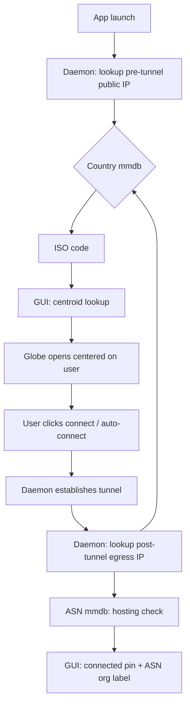

# Self-hosted GeoIP integration — Rust VPN daemon + 3D globe frontend

This guide wires the self-hosted GeoIP stack (GeoLite2 / DB-IP / `ip-location-db`, all `.mmdb`-format, no signup) directly into your existing architecture: a pure-Rust daemon for the VPN backend and an `egui` + `three-d` frontend rendering the globe. It covers what data you actually need at each layer, how to keep it inside your RAM budget, how the daemon exposes it to the GUI, and how it drives the globe's camera and country highlighting.

---

## 1. Where GeoIP fits in your architecture

There are exactly three moments where geolocation data is useful in a VPN client, and none of them require a third-party API call:

**Before connecting** — the daemon looks up the user's *current* public IP (pre-tunnel) against the local country `.mmdb` to know what country they're physically in. This drives "auto-connect to nearest server" and lets the globe open already centered on the user instead of a default world view.

**At connect time** — the selected server's country ISO code (which you already know, since you own the server) is the key that the frontend uses to look up a lat/lng centroid and fly the camera there.

**After connecting** — the daemon re-runs the same lookup against the new egress IP. If it resolves to the expected server country and the ASN looks like a hosting/datacenter network rather than a residential ISP, that's a cheap, local sanity check that the tunnel actually came up and isn't leaking. This is the most underused part of a self-hosted GeoIP stack in a VPN product — most clients skip it and just trust the OS routing table.

None of this needs City-level data or any of the "Priority 4" deep enrichment (RDAP, BGP, RouteViews) from the source stack. Those are research/ops tools, not client-facing features — keep them on your own infrastructure for analytics and abuse investigation, never call them from the client.



---

## 2. Design decisions for your RAM budget

The source document defaults to pulling Country, ASN, and City for every layer. For your daemon's 30 MB ceiling, trim that down deliberately:

| Database | Disk size | Use it now? | Why |
|---|---|---|---|
| Country mmdb (DB-IP or `ip-location-db`) | ~3–8 MB | Yes | This is the only thing the globe needs — you're only drawing borders to country level for now |
| ASN mmdb | ~5–10 MB | Yes | Needed for the post-connect "is this actually a VPN exit" sanity check and for displaying "Connected via Hetzner Online GmbH" type labels |
| City mmdb | ~50–70 MB | No, not yet | You don't need state/city precision for a country-level globe. Adding it later is a one-line config change — see §13 |
| Connection-type lists (X4BNet / FireHOL) | ~1–4 MB compressed | Optional | Only if you want to warn users who are already behind a VPN/proxy before they connect (double-VPN detection) |

Two more decisions specific to a commercial product rather than a personal self-hosted box:

**Skip the GeoLite2 community mirror.** The source document is upfront that MaxMind's EULA has a redistribution gray area, and that's fine for a personal server. It's not fine to bake into an auto-updating pipeline inside a product you ship to users. Use **DB-IP Lite (CC BY 4.0)** or **`ip-location-db` (PDDL, public domain)** as your primary country source instead — both are unambiguously clean for redistribution, and DB-IP's only obligation (a visible attribution link) is trivially satisfied with one line in your settings/about screen.

**mmap reality check on RAM.** A `.mmdb` file is memory-mapped read-only, not loaded into the heap. The OS only pages in the parts of the file your lookups actually touch, and those pages are reclaimable, shared page-cache — not anonymous memory your daemon "owns." For a Country-level file (a few MB) doing occasional lookups, expect well under 1 MB of resident memory attributable to the database itself even though the file on disk is several MB. This is what makes mmdb the right format for your constraint — a naive CSV-loaded-into-a-Vec approach would actually cost you real heap.

---

## 3. Workspace layout

```
your-vpn-app/
├── crates/
│   ├── daemon/                  # existing VPN daemon
│   │   ├── src/
│   │   │   ├── geoip/
│   │   │   │   ├── mod.rs
│   │   │   │   ├── stack.rs      # GeoIpStack, hot-reload
│   │   │   │   ├── refresh.rs    # background updater
│   │   │   │   └── conn_type.rs  # VPN/datacenter detection
│   │   │   └── ipc/
│   │   │       └── geo_commands.rs
│   │   └── Cargo.toml
│   ├── gui/                      # egui + three-d frontend
│   │   ├── src/
│   │   │   ├── globe/
│   │   │   │   ├── centroids.rs
│   │   │   │   ├── camera_tween.rs
│   │   │   │   └── borders.rs
│   │   │   └── assets/
│   │   │       ├── country_centroids.json   # ~250 entries, bundled at compile time
│   │   │       └── countries_50m.geojson    # Natural Earth borders
│   └── geo-protocol/             # shared types between daemon and gui
│       └── src/lib.rs
└── data/
    └── geoip/
        ├── dbip-country-lite.mmdb
        ├── dbip-asn-lite.mmdb
        └── conn-type/
            ├── vpn-ipv4.bin
            └── datacenter-ipv4.bin
```

`geo-protocol` is a tiny shared crate so the daemon and GUI agree on wire types without duplicating struct definitions — both already depend on a shared crate if you're using socket/pipe IPC, so this just adds geo-specific request/response variants to it.

---

## 4. Dependencies

```toml
# crates/daemon/Cargo.toml
[dependencies]
maxminddb = "0.24"
arc-swap = "1.7"          # lock-free hot-reload of the mmdb reader
iprange = "0.6"           # radix-trie CIDR matching for conn-type lists
ipnet = "2.9"
reqwest = { version = "0.12", default-features = false, features = ["rustls-tls"] }
flate2 = "1"              # dbip ships .gz
tokio = { version = "1", features = ["rt-multi-thread", "time", "fs", "net"] }
serde = { version = "1", features = ["derive"] }
thiserror = "2"

# crates/gui/Cargo.toml
[dependencies]
serde_json = "1"
```

`reqwest` with `rustls-tls` instead of the default `native-tls` avoids linking OpenSSL — smaller binary, no system TLS library version drift, consistent with keeping the daemon lean.

---

## 5. Core geoip module — daemon side

### 5.1 Types

```rust
// crates/geo-protocol/src/lib.rs
use serde::{Deserialize, Serialize};

#[derive(Debug, Clone, Serialize, Deserialize)]
pub struct CountryInfo {
    pub iso_code: String,   // "DE", "US", "JP" — this is your globe lookup key
    pub name: String,
    pub continent: String,
}

#[derive(Debug, Clone, Serialize, Deserialize)]
pub struct AsnInfo {
    pub number: u32,
    pub org: String,
}

#[derive(Debug, Clone, Copy, PartialEq, Serialize, Deserialize)]
pub enum ConnectionType {
    Residential,
    Datacenter,
    KnownVpnExit,
    Unknown,
}

#[derive(Debug, Clone, Serialize, Deserialize)]
pub struct GeoSnapshot {
    pub ip: String,
    pub country: Option<CountryInfo>,
    pub asn: Option<AsnInfo>,
    pub connection_type: ConnectionType,
}
```

### 5.2 GeoIpStack with hot-reload

Wrapping the reader in `ArcSwap` rather than `RwLock` matters here — lookups happen on every connect/disconnect event and you don't want them blocking on a writer lock during the weekly refresh. `ArcSwap::load()` is effectively free (an atomic pointer read), and a refresh just swaps the pointer once the new file is validated.

```rust
// crates/daemon/src/geoip/stack.rs
use arc_swap::ArcSwap;
use maxminddb::{geoip2, Reader};
use std::{path::PathBuf, sync::Arc};
use geo_protocol::{CountryInfo, AsnInfo};

pub struct GeoIpStack {
    country: ArcSwap<Reader<Vec<u8>>>,
    asn: ArcSwap<Reader<Vec<u8>>>,
    country_path: PathBuf,
    asn_path: PathBuf,
}

impl GeoIpStack {
    pub fn open(country_path: PathBuf, asn_path: PathBuf) -> anyhow::Result<Self> {
        let country = Reader::open_readfile(&country_path)?;
        let asn = Reader::open_readfile(&asn_path)?;
        Ok(Self {
            country: ArcSwap::from_pointee(country),
            asn: ArcSwap::from_pointee(asn),
            country_path,
            asn_path,
        })
    }

    pub fn lookup_country(&self, ip: std::net::IpAddr) -> Option<CountryInfo> {
        let reader = self.country.load();
        let rec: geoip2::Country = reader.lookup(ip).ok()??;
        let country = rec.country?;
        Some(CountryInfo {
            iso_code: country.iso_code?.to_string(),
            name: country.names?.get("en")?.to_string(),
            continent: rec.continent?.code?.to_string(),
        })
    }

    pub fn lookup_asn(&self, ip: std::net::IpAddr) -> Option<AsnInfo> {
        let reader = self.asn.load();
        let rec: geoip2::Asn = reader.lookup(ip).ok()??;
        Some(AsnInfo {
            number: rec.autonomous_system_number?,
            org: rec.autonomous_system_organization?.to_string(),
        })
    }

    /// Re-opens both files from disk and atomically swaps the active readers.
    /// Called by the refresh task after a new file has been validated.
    pub fn reload(&self) -> anyhow::Result<()> {
        let new_country = Reader::open_readfile(&self.country_path)?;
        let new_asn = Reader::open_readfile(&self.asn_path)?;
        self.country.store(Arc::new(new_country));
        self.asn.store(Arc::new(new_asn));
        Ok(())
    }
}
```

Note `Reader::open_readfile` (not `from_source`) — this is the mmap-backed variant. It's what gives you the lazy paging behavior described in §2 rather than reading the whole file into a `Vec<u8>` upfront.

### 5.3 Connection-type detection (VPN/datacenter flagging)

This uses the X4BNet/FireHOL lists from the source stack, loaded into a CIDR trie once at startup. It's the piece that lets you say "you appear to already be behind a VPN" before connecting, and "tunnel confirmed active, exiting via a datacenter network" after.

```rust
// crates/daemon/src/geoip/conn_type.rs
use iprange::IpRange;
use ipnet::Ipv4Net;
use std::net::IpAddr;
use geo_protocol::ConnectionType;

pub struct ConnTypeMatcher {
    vpn_ranges: IpRange<Ipv4Net>,
    datacenter_ranges: IpRange<Ipv4Net>,
}

impl ConnTypeMatcher {
    pub fn load(vpn_list_path: &std::path::Path, dc_list_path: &std::path::Path) -> anyhow::Result<Self> {
        let vpn_ranges = parse_cidr_file(vpn_list_path)?;
        let datacenter_ranges = parse_cidr_file(dc_list_path)?;
        Ok(Self { vpn_ranges, datacenter_ranges })
    }

    pub fn classify(&self, ip: IpAddr) -> ConnectionType {
        let IpAddr::V4(v4) = ip else { return ConnectionType::Unknown };
        if self.vpn_ranges.contains(&v4) {
            ConnectionType::KnownVpnExit
        } else if self.datacenter_ranges.contains(&v4) {
            ConnectionType::Datacenter
        } else {
            ConnectionType::Residential
        }
    }
}

fn parse_cidr_file(path: &std::path::Path) -> anyhow::Result<IpRange<Ipv4Net>> {
    let mut range = IpRange::new();
    for line in std::fs::read_to_string(path)?.lines() {
        let line = line.trim();
        if line.is_empty() || line.starts_with('#') { continue; }
        if let Ok(net) = line.parse::<Ipv4Net>() {
            range.add(net);
        }
    }
    range.simplify();
    Ok(range)
}
```

`IpRange` from the `iprange` crate builds a compact trie rather than a flat list, so even with tens of thousands of CIDR entries (X4BNet's datacenter list is large), lookups stay O(32) bit comparisons and the structure itself is a few hundred KB resident — negligible against your budget.

### 5.4 Background refresher

A Rust-native equivalent of the cron script in the source stack, running as a `tokio` task inside the daemon rather than a separate cron job — one less moving part to deploy.

```rust
// crates/daemon/src/geoip/refresh.rs
use std::{sync::Arc, time::Duration};
use tokio::time::interval;
use crate::geoip::stack::GeoIpStack;

pub fn spawn_refresh_task(stack: Arc<GeoIpStack>, data_dir: std::path::PathBuf) {
    tokio::spawn(async move {
        // Stagger slightly so you're not hammering the source on the exact
        // hour every other self-hoster also picked.
        let mut ticker = interval(Duration::from_secs(7 * 24 * 3600));
        loop {
            ticker.tick().await;
            if let Err(e) = refresh_once(&stack, &data_dir).await {
                tracing::warn!("geoip refresh failed, keeping current databases: {e}");
            }
        }
    });
}

async fn refresh_once(stack: &GeoIpStack, data_dir: &std::path::Path) -> anyhow::Result<()> {
    let year_month = chrono::Utc::now().format("%Y-%m").to_string();
    download_and_validate(
        &format!("https://download.db-ip.com/free/dbip-country-lite-{year_month}.mmdb.gz"),
        &data_dir.join("dbip-country-lite.mmdb.tmp"),
        &data_dir.join("dbip-country-lite.mmdb"),
    ).await?;
    download_and_validate(
        &format!("https://download.db-ip.com/free/dbip-asn-lite-{year_month}.mmdb.gz"),
        &data_dir.join("dbip-asn-lite.mmdb.tmp"),
        &data_dir.join("dbip-asn-lite.mmdb"),
    ).await?;
    stack.reload()
}

async fn download_and_validate(url: &str, tmp_path: &std::path::Path, final_path: &std::path::Path) -> anyhow::Result<()> {
    let bytes = reqwest::get(url).await?.bytes().await?;
    let mut decoder = flate2::read::GzDecoder::new(&bytes[..]);
    let mut decompressed = Vec::new();
    std::io::Read::read_to_end(&mut decoder, &mut decompressed)?;
    tokio::fs::write(tmp_path, &decompressed).await?;

    // Validate before promoting — never let a truncated download replace a working file.
    maxminddb::Reader::open_readfile(tmp_path)?;

    // POSIX rename is atomic. On Windows, renaming over a file that's
    // currently memory-mapped by an open Reader will fail with a sharing
    // violation — reload() must run *after* this rename completes, and the
    // old Reader handle must be dropped (which ArcSwap's store() does, once
    // the last lookup using the old Arc finishes) before the *next* refresh
    // cycle tries to rename again. In practice this means: rename, then
    // reload, then proceed — never reload before the rename settles.
    tokio::fs::rename(tmp_path, final_path).await?;
    Ok(())
}
```

The Windows caveat in that comment is worth taking seriously if you ship there — `tokio::fs::rename` over a file with an active mmap will return an OS error rather than silently corrupting anything, so the failure mode is safe (you just keep the old database and retry next cycle), but it's why the rename-then-reload ordering matters.

---

## 6. Self-hosted "what's my IP" pre-connect probe

The one piece the source stack doesn't cover: before the user connects, the daemon doesn't actually know the device's current public IP — that's only visible from the outside. Rather than calling a third-party "what is my IP" service (which leaks the request to someone outside your infrastructure, undermining the whole self-hosted premise), expose a one-line endpoint on your own edge servers:

```rust
// On your VPN server software, not the client — any lightweight HTTP stack works
use axum::{Router, routing::get, extract::ConnectInfo};
use std::net::SocketAddr;

async fn whoami(ConnectInfo(addr): ConnectInfo<SocketAddr>) -> String {
    addr.ip().to_string()
}

pub fn router() -> Router {
    Router::new().route("/v1/whoami", get(whoami))
}
```

The daemon calls this once at app launch (a single small HTTPS request to your own infrastructure, over a connection that's already trusted) to learn the device's current public IP, then runs it through the local country mmdb. The same endpoint, called again *through the tunnel* after connecting, gives you the post-connect verification IP for free — no separate mechanism needed.

---

## 7. Daemon ↔ GUI IPC contract

Extend whatever socket/pipe protocol you're already using between the daemon and the GUI with geo-specific request/response variants:

```rust
// crates/geo-protocol/src/lib.rs (continued)
#[derive(Debug, Serialize, Deserialize)]
pub enum DaemonRequest {
    GetClientLocation,
    GetServerList,
    Connect { server_id: String },
    GetConnectionVerification,
}

#[derive(Debug, Serialize, Deserialize)]
pub enum DaemonResponse {
    ClientLocation(GeoSnapshot),
    ServerList(Vec<ServerEntry>),
    Connected { verification: GeoSnapshot },
    Error(String),
}

#[derive(Debug, Clone, Serialize, Deserialize)]
pub struct ServerEntry {
    pub id: String,
    pub city: String,
    pub country_iso: String,
    pub lat: f64,
    pub lng: f64,
    pub load_pct: u8,
}
```

`ServerEntry` coordinates come from your own server inventory, not GeoIP — you already know exactly where your boxes are. GeoIP only ever answers questions about the *client's* IP, never your own infrastructure's.

---

## 8. Frontend: country ISO → globe coordinates

This is the piece that ties the GeoIP output to the 3D globe from the earlier design.

### 8.1 Centroid table

Bundle the centroid JSON at compile time so there's zero runtime file I/O or network dependency for something that never changes between releases:

```rust
// crates/gui/src/globe/centroids.rs
use std::collections::HashMap;
use serde::Deserialize;

#[derive(Deserialize)]
pub struct Centroid { pub name: String, pub lat: f64, pub lng: f64 }

pub struct CentroidTable(HashMap<String, Centroid>);

impl CentroidTable {
    pub fn load() -> Self {
        const RAW: &str = include_str!("../assets/country_centroids.json");
        let map: HashMap<String, Centroid> = serde_json::from_str(RAW)
            .expect("bundled centroid file is malformed");
        Self(map)
    }

    pub fn get(&self, iso_code: &str) -> Option<&Centroid> {
        self.0.get(iso_code)
    }
}
```

### 8.2 Lat/lng → 3D vector

Same projection math as the Three.js version, just in Rust:

```rust
// crates/gui/src/globe/mod.rs
pub fn lat_lng_to_vec3(lat: f64, lng: f64, radius: f32) -> three_d::Vec3 {
    let phi = (90.0 - lat).to_radians();
    let theta = (lng + 180.0).to_radians();
    three_d::vec3(
        (-radius as f64 * phi.sin() * theta.cos()) as f32,
        (radius as f64 * phi.cos()) as f32,
        (radius as f64 * phi.sin() * theta.sin()) as f32,
    )
}
```

### 8.3 Camera fly-to (Rust port of the GSAP tween)

There's no GSAP in Rust, but a frame-driven cubic ease is about fifteen lines and gives you the same feel. Drive it from your `three-d` render loop's per-frame update:

```rust
// crates/gui/src/globe/camera_tween.rs
use three_d::Vec3;

pub struct CameraTween {
    start: Vec3,
    end: Vec3,
    elapsed: f32,
    duration: f32,
    active: bool,
}

impl CameraTween {
    pub fn start(current: Vec3, target: Vec3, duration_secs: f32) -> Self {
        Self { start: current, end: target, elapsed: 0.0, duration: duration_secs, active: true }
    }

    /// Call once per frame with delta time. Returns the new camera position
    /// while the tween is running, None once it's finished or inactive.
    pub fn tick(&mut self, dt: f32) -> Option<Vec3> {
        if !self.active { return None; }
        self.elapsed += dt;
        let t = (self.elapsed / self.duration).clamp(0.0, 1.0);
        let eased = ease_in_out_cubic(t);
        let pos = self.start + (self.end - self.start) * eased;
        if t >= 1.0 { self.active = false; }
        Some(pos)
    }
}

fn ease_in_out_cubic(t: f32) -> f32 {
    if t < 0.5 { 4.0 * t * t * t } else { 1.0 - (-2.0 * t + 2.0).powi(3) / 2.0 }
}
```

Camera always looks at the globe's origin while the tween runs, matching the `lookAt` call in the JS version.

### 8.4 Click-to-select on the globe

For country-level granularity, full point-in-spherical-polygon testing against the GeoJSON is overkill and adds real complexity for edge cases (polygons crossing the antimeridian, multi-part countries like Indonesia). Nearest-centroid is simpler, fast, and accurate enough at country scale:

```rust
pub fn nearest_country(click_lat: f64, click_lng: f64, centroids: &CentroidTable, isos: &[String]) -> Option<String> {
    isos.iter()
        .filter_map(|iso| centroids.get(iso).map(|c| (iso.clone(), haversine_km(click_lat, click_lng, c.lat, c.lng))))
        .min_by(|a, b| a.1.partial_cmp(&b.1).unwrap())
        .map(|(iso, _)| iso)
}

fn haversine_km(lat1: f64, lng1: f64, lat2: f64, lng2: f64) -> f64 {
    let r = 6371.0;
    let d_lat = (lat2 - lat1).to_radians();
    let d_lng = (lng2 - lng1).to_radians();
    let a = (d_lat / 2.0).sin().powi(2)
        + lat1.to_radians().cos() * lat2.to_radians().cos() * (d_lng / 2.0).sin().powi(2);
    2.0 * r * a.sqrt().asin()
}
```

Reuse the same ray-sphere intersection you're already using to convert a mouse click into a lat/lng on the globe surface, then feed that into this function.

### 8.5 Border highlighting

Once you have an ISO code (from a click, from GeoIP, or from selecting a server), filter your loaded GeoJSON features by `properties.ISO_A2 == iso_code` and re-render just that feature's line segments in an accent color — everything else stays the neutral border color. No need to touch the rest of the border mesh.

### 8.6 Required asset files

No 3D model file is needed for the globe itself — it's a procedurally generated sphere (§8.7) with a texture wrapped around it. The only files to actually download are the texture images and the border GeoJSON, all from sources with no signup and no API key.

| Asset | Direct link | License |
|---|---|---|
| Country borders, 50m resolution | `https://raw.githubusercontent.com/nvkelso/natural-earth-vector/master/geojson/ne_50m_admin_0_countries.geojson` | Public domain (CC0) |
| Country borders, 10m (higher detail, optional) | `https://raw.githubusercontent.com/nvkelso/natural-earth-vector/master/geojson/ne_10m_admin_0_countries.geojson` | Public domain |
| Earth day texture, 2K | `https://www.solarsystemscope.com/textures/download/2k_earth_daymap.jpg` | CC BY 4.0 |
| Earth night lights, 2K | `https://www.solarsystemscope.com/textures/download/2k_earth_nightmap.jpg` | CC BY 4.0 |
| Cloud layer, 2K | `https://www.solarsystemscope.com/textures/download/2k_earth_clouds.jpg` | CC BY 4.0 |
| Normal map, 2K (optional bump detail) | `https://www.solarsystemscope.com/textures/download/2k_earth_normal_map.tif` | CC BY 4.0 |
| Specular map, 2K (optional ocean shine) | `https://www.solarsystemscope.com/textures/download/2k_earth_specular_map.tif` | CC BY 4.0 |
| Starfield background | `https://www.solarsystemscope.com/textures/download/2k_stars_milky_way.jpg` | CC BY 4.0 |

The Natural Earth repo above is the official maintainer's GitHub, not a third-party redistribution. The Solar System Scope textures require one attribution line somewhere in the app or about screen per the CC BY 4.0 terms (same obligation tier as the DB-IP attribution already tracked in §10). 2K resolution is the right call against the VRAM budget from §2 — 8K versions exist on the same page but aren't worth the extra GPU memory at the zoom levels a VPN globe actually uses.

### 8.7 How the borders end up precisely aligned to the sphere

The risk with a procedurally generated sphere plus a separately drawn border layer is that they disagree about where `lat 0, lng 0` actually sits in 3D space — if the texture's UV wrapping uses a different convention than the border projection math, the coastlines baked into the texture and the GeoJSON border lines drift apart, most visibly near the poles.

The fix is to not rely on a graphics library's built-in sphere primitive for this, since its internal UV convention isn't something you control or can fully verify. Instead, generate the sphere mesh by hand using the exact same `lat_lng_to_vec3` function from §8.2 for both the sphere's vertices and the border lines. When one function drives both, they're guaranteed to agree — there's no second convention to drift out of sync with the first.

```rust
// crates/gui/src/globe/mesh.rs
use three_d::{CpuMesh, Positions, Indices, vec2};
use crate::globe::lat_lng_to_vec3;

pub fn build_globe_mesh(lat_segments: u32, lng_segments: u32, radius: f32) -> CpuMesh {
    let mut positions = Vec::new();
    let mut uvs = Vec::new();

    for y in 0..=lat_segments {
        let v = y as f32 / lat_segments as f32;     // 0 = north pole, 1 = south pole
        let lat = 90.0 - v * 180.0;
        for x in 0..=lng_segments {
            let u = x as f32 / lng_segments as f32; // 0 -> 1 maps to -180 -> 180
            let lng = u * 360.0 - 180.0;
            positions.push(lat_lng_to_vec3(lat as f64, lng as f64, radius));
            uvs.push(vec2(u, v));
        }
    }

    let mut indices = Vec::new();
    for y in 0..lat_segments {
        for x in 0..lng_segments {
            let i0 = y * (lng_segments + 1) + x;
            let (i1, i2, i3) = (i0 + 1, i0 + lng_segments + 1, i0 + lng_segments + 2);
            indices.extend_from_slice(&[i0, i2, i1, i1, i2, i3]);
        }
    }

    CpuMesh {
        positions: Positions::F32(positions),
        uvs: Some(uvs),
        indices: Indices::U32(indices),
        ..Default::default()
    }
}
```

The border lines are built the same way, walking GeoJSON ring coordinates instead of a regular grid, and calling the identical projection function:

```rust
// crates/gui/src/globe/borders.rs
use geojson::{GeoJson, Value};
use crate::globe::lat_lng_to_vec3;

pub fn build_border_lines(geojson_str: &str, radius: f32) -> Vec<(three_d::Vec3, three_d::Vec3, String)> {
    let geojson: GeoJson = geojson_str.parse().expect("invalid geojson");
    let mut segments = Vec::new();

    let GeoJson::FeatureCollection(fc) = geojson else { return segments };
    for feature in fc.features {
        let iso = feature.properties.as_ref()
            .and_then(|p| p.get("ISO_A2"))
            .and_then(|v| v.as_str())
            .unwrap_or("UNKNOWN")
            .to_string();

        let rings: Vec<Vec<Vec<f64>>> = match feature.geometry.map(|g| g.value) {
            Some(Value::Polygon(rings)) => rings,
            Some(Value::MultiPolygon(polys)) => polys.into_iter().flatten().collect(),
            _ => continue,
        };

        for ring in rings {
            // Raised slightly above the sphere surface to avoid z-fighting
            // against the textured globe underneath.
            let raised = radius * 1.002;
            let points: Vec<_> = ring.iter()
                .map(|c| lat_lng_to_vec3(c[1], c[0], raised))
                .collect();
            for pair in points.windows(2) {
                segments.push((pair[0], pair[1], iso.clone()));
            }
        }
    }
    segments
}
```

One classic mapping problem this sidesteps for free: the antimeridian (±180° longitude, cutting through the Pacific) splits countries like Russia, Fiji, and the Aleutian tip of the US across the edge of most flat map projections, producing a stray line stretching across the whole canvas unless you preprocess the polygons to clip and re-split them. On a sphere this isn't a problem — longitude 179° and -179° are genuinely close together in 3D space, so two adjacent ring points near that seam just produce a short, correctly placed line segment. The only place the seam still matters is the texture's UV wrap, and since `build_globe_mesh` and `build_border_lines` share the exact same `lat_lng_to_vec3` definition, the texture seam and the geometric border seam are pinned to the same meridian by construction — there's nothing left to calibrate by hand.

One practical rendering note: thin `LINES`-primitive geometry can render inconsistently thin or near-invisible depending on GPU driver support for line width. If borders look too faint at typical zoom, render each segment as a small camera-facing ribbon (two triangles) instead of relying on driver-specific line-width settings.

---

## 9. Auto-connect and the full pre/post verification flow

Putting §5–§8 together end to end:

1. App launches. Daemon calls its own `whoami` endpoint (§6), gets the device's current public IP.
2. Daemon runs `GeoIpStack::lookup_country` on that IP → `CountryInfo { iso_code: "IN", .. }`.
3. Daemon also runs `lookup_asn` + `ConnTypeMatcher::classify` → if `KnownVpnExit`, the GUI can show "You appear to already be behind a VPN" before the user even picks a server.
4. GUI receives `GeoSnapshot` over IPC, looks up `"IN"` in the centroid table, flies the camera there on load.
5. User clicks "auto-connect" — daemon picks the nearest `ServerEntry` to the client's centroid by haversine distance (same function as §8.4, just comparing the client's coordinate against your server inventory instead of country centroids), optionally tie-broken by current `load_pct` if two servers are close.
6. Daemon establishes the tunnel, then calls `whoami` again — this time the request travels through the tunnel, so the response is the server's egress IP, not the device's.
7. Daemon runs the same country + ASN lookup on that egress IP. If `iso_code` matches the connected server's country and `connection_type` resolves to `Datacenter`, that's your "tunnel verified" signal — surface it in the UI as "Connected via {asn.org}, {country.name}" rather than just a green checkmark with no evidence behind it.

This closes the loop using only data you already host yourself — no step in this flow makes an external network call to anyone other than your own edge servers and your own database mirrors.

---

## 10. License and attribution checklist

| Source | Obligation | Where it shows up |
|---|---|---|
| DB-IP Lite (primary, recommended) | CC BY 4.0 — visible attribution link on any public-facing display of the geo data | One line in Settings → About, e.g. "IP geolocation data by DB-IP.com" |
| `ip-location-db` (PDDL) | None | — |
| X4BNet lists | MIT — attribution appreciated, not required | Optional credit in About |
| FireHOL lists | GPLv2 — permissive for internal use | — |
| Your own `whoami` endpoint | N/A, it's yours | — |

Avoid the GeoLite2 community mirror for the reasons in §2 — it's a reasonable choice for a personal self-hosted box, not for a redistributed product.

---

## 11. Memory and performance summary

| Component | Resident RAM impact | Notes |
|---|---|---|
| Country mmdb (mmap) | ~0.1–1 MB typical | Pages lazily faulted in, reclaimable |
| ASN mmdb (mmap) | ~0.1–1 MB typical | Same |
| `IpRange` CIDR tries (VPN + datacenter lists) | ~1–3 MB | Built once at startup, held in heap |
| `ArcSwap` overhead | Negligible | Single atomic pointer per reader |
| Centroid table (GUI side) | <100 KB | ~250 small structs in a HashMap |
| Weekly refresh task | Transient ~10–20 MB during download/decompress, released after swap | Runs once a week, not steady-state |

None of this meaningfully competes with your 30 MB daemon target or 70 MB full-GUI target — the entire GeoIP layer adds low single-digit megabytes of genuine resident memory in steady state.

---

## 12. Testing checklist

- Validate every downloaded `.mmdb` with a known-good lookup (`8.8.8.8`) before promoting it — never let a truncated file go live (§5.4 already does this).
- Test the rename-over-mmap path specifically on Windows in CI; confirm the retry-next-cycle behavior rather than assuming POSIX semantics everywhere.
- Feed both IPv4 and IPv6 test addresses through `lookup_country` — DB-IP and `ip-location-db` files contain both trees in one file, same as GeoLite2, so no branching is needed, but test it anyway.
- Confirm the post-connect verification step correctly fails closed: if the post-tunnel lookup can't be completed (network hiccup), don't silently mark the connection as verified — surface "verification pending" rather than a false positive.

---

## 13. Upgrading to City-level later

If you eventually need state/city precision (e.g., showing "Frankfurt" rather than just "Germany" for server selection), the change is additive, not a rewrite: add a third `ArcSwap<Reader<...>>` field to `GeoIpStack` for `dbip-city-lite.mmdb`, add a `lookup_city` method following the exact pattern in §5.2, and extend `GeoSnapshot` with an optional `city: Option<CityInfo>` field. Everything in §6–§9 keeps working unchanged since they all key off `iso_code`, not city data.